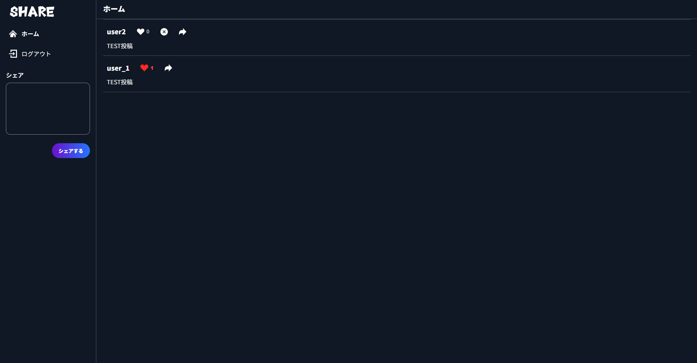
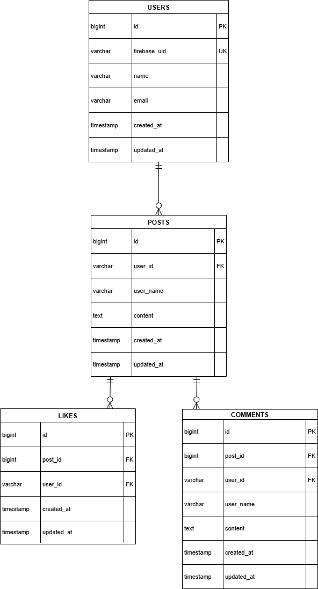

# Twitter風SNSアプリ

Firebase認証とLaravel APIを組み合わせた、  
**投稿・いいね・コメント機能を備えた Twitter風SNSアプリ**です。



---

## 作成した目的

- Firebase認証とLaravel APIを組み合わせた実践的な構成を理解するため
- SPA（Single Page Application）の実装経験を積むため
- バリデーション・認証・CRUD処理を一通り自力で実装できるようになるため
- フロントとバックエンドを分離した設計に慣れるため

---

## アプリケーションURL

※ 現在は **ローカル環境での開発のみ**  

### ローカルURL
- Front（Nuxt）：`http://localhost:3000`
- API（Laravel）：`http://localhost:8000/api`

---

## 他のリポジトリ

本リポジトリは **フロントエンド・バックエンドを1つのリポジトリで管理**しています。


---

## 機能一覧

### 認証機能（Firebase Authentication）
- 新規登録
- ログイン / ログアウト
- 表示名（ユーザー名）の保存

### 投稿機能
- 投稿一覧表示
- 新規投稿
- 投稿削除（自分の投稿のみ）

### いいね機能
- いいね追加 / 解除
- いいね数のリアルタイム反映

### コメント機能
- コメント一覧表示
- コメント投稿
- 入力バリデーション（必須 / 120文字以内）

---

## 使用技術（実行環境）

### フロントエンド
- JavaScript（Nuxt 3）
- TypeScript
- VeeValidate / Yup（バリデーション）
- Firebase Authentication（認証）

### バックエンド
- PHP（Laravel）
- Laravel API
- Firebase ID Token 認証

### その他
- Docker（Laravel側）
- Git / GitHub

---

## テーブル設計
本アプリでは、Firebase Authentication を用いた認証を前提とし、
**ユーザー情報は最小限のみDBに保持**する構成としています。

投稿・いいね・コメント機能を実現するため、
以下の4テーブルで設計しています。

### テーブル概要

| テーブル名 | 説明 |
|-----------|------|
| users     | Firebase UID を基準にしたユーザー情報（表示名・メール） |
| posts     | 投稿データ（本文・投稿者・表示名スナップショット） |
| likes     | 投稿へのいいね情報（post × user の中間テーブル） |
| comments  | 投稿へのコメント情報 |

※ 投稿・コメントの表示名は、投稿時点の表示名を保持するため  
`user_name` をスナップショットとして保存しています。

---

## ER図


---

## 環境構築

### 1. リポジトリをクローン
```bash
# HTTPS
git clone https://github.com/kie-okamoto/twitter-sns.git

# SSH
git clone git@github.com:kie-okamoto/twitter-sns.git

cd twitter-sns
```
### 2. フロントエンドのセットアップ
```
cd front
npm install
npm run dev
```

### 3. フロントエンド環境変数を設定
`front/.env` を作成し、以下を記載します。

```env
NUXT_PUBLIC_API_BASE=http://localhost:8000/api
NUXT_PUBLIC_FIREBASE_API_KEY=xxxx
NUXT_PUBLIC_FIREBASE_AUTH_DOMAIN=xxxx
NUXT_PUBLIC_FIREBASE_PROJECT_ID=xxxx
NUXT_PUBLIC_FIREBASE_APP_ID=xxxx
NUXT_PUBLIC_FIREBASE_STORAGE_BUCKET=xxxx
NUXT_PUBLIC_FIREBASE_MESSAGING_SENDER_ID=xxxx
```

### 4. API(Laravel)のセットアップ
```
cd api
composer install
cp .env.example .env
php artisan key:generate
php artisan serve
```

---

## テスト（PHPUnit）

本アプリでは、Laravel API 側に対して  
**PHPUnit を用いた Feature Test（APIテスト）** を実装しています。

Firebase Authentication を使用しているため、  
テスト実行時は **Firebase認証をテスト用ミドルウェアで差し替える構成** を採用しています。

---

### テスト方針

- Feature Test（API）
- SQLite（in-memory）を使用
- Firebase Authentication は **TestFirebaseToken ミドルウェアで擬似認証**
- 実装仕様に沿った **正常系・異常系・権限制御** を確認

---

### テスト対象機能

#### 投稿（Posts）
- 投稿一覧取得（GET /posts）
- 投稿作成（POST /posts）
- 投稿バリデーション（120文字超で422）
- 投稿削除（本人のみ可能）
- 他人の投稿削除は403

#### いいね（Likes）
- いいね追加（POST /likes）
- 重複いいね防止（idempotent）
- いいね解除（DELETE /likes/{post}）
- いいね数の正しい返却

#### コメント（Comments）
- コメント一覧取得（新しい順）
- コメント投稿
- バリデーション（必須 / 120文字以内）
- 投稿時点の user_name をスナップショット保存

### テスト用Firebase認証（重要）

Firebase Authentication を利用しているため、テスト時は認証を擬似化しています。

- テスト用ミドルウェア：`api/app/Http/Middleware/TestFirebaseToken.php`
- Feature Test：`api/tests/Feature/PostsTest.php` / `LikesTest.php` / `CommentsTest.php`
- DB：`phpunit.xml` で SQLite（in-memory）を使用


---

### テスト実行方法

#### API（Laravel）側で実行
```bash
cd api
php artisan test
```
# 個別実行例
php artisan test --filter PostsTest
